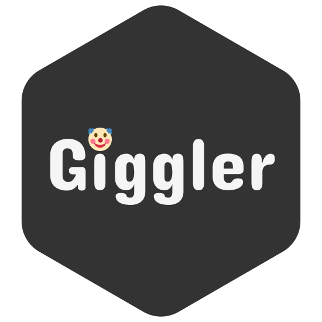

# giggler-golang

_Work in progress_

## Description



**Giggler** is a social network based on the idea of sharing and discussing jokes. This repository contains the **REST API** for the social network.

The project utilizes **feature-first** design, where features are first-class citizens. Each feature is a standalone package, that contains all its initialisation, dependecy injection, etc.

## On the architecture

TODO: rewrite this text
\*The main components of a microkernel-based system are:

1. Microkernel (Core System): Handles essential services like resource management, low-level communication, and system startup. It is lightweight, efficient, and rarely changes.
2. Plugins (Extension Modules): Add functionality to the system. Plugins may include user interfaces, additional services, or external integrations that can evolve independently from the core.

The communication between the microkernel and the plugins occurs through well-defined interfaces, enabling a decoupled and flexible architecture that facilitates the addition of new features.

Microkernel Architecture in Action

-

## Local launch setup

The project is supposed to be run using the docker compose.

### Requirements

Ensure you have the following installed:

- `docker`

### Initialize

Clone the repo and ....

## Development setup

### Requirements

Ensure you have the following installed:

- `go`
- `npm`
- `task`
- `docker`

### Initialise

Clone the repo, cd into it and run the following command:

```
bash .config/init-workspace.sh
```

It will prepare the environment for you.

## Designs

All the designs are available in [Figma](https://www.figma.com/design/sdu0PTLD3NOxOLNNI1S23f/)
