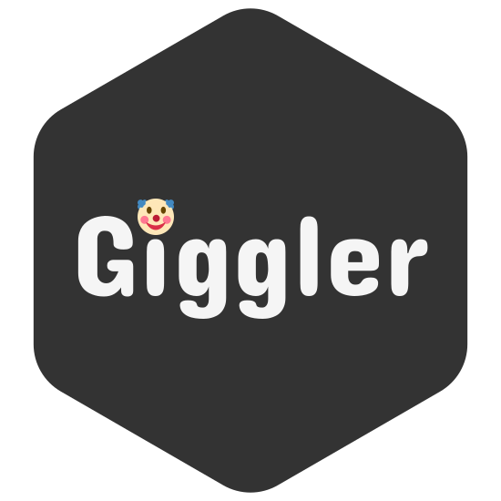

# giggler-golang

_Work in progress_

## Description



**Giggler** is a social network based on the idea of sharing and discussing jokes. This repository contains the **REST API** for the social network.

The project utilizes **feature-first** design, where features are first-class citizens. Each feature is a standalone package, that contains all its initialisation, dependecy injection, etc.

## On the architecture

## Local launch setup

The project is supposed to be run using the docker compose.

### Requirements

Ensure you have the following installed:

- `docker`

### Initialize

Clone the repo and ....

## Development setup

### Requirements

Ensure you have the following installed:

- `go`
- `npm`
- `task`
- `docker`

### Initialise

Clone the repo, cd into it and run the following command:

```
bash config/init-workspace.sh
```

It will prepare the environment for you.

## Designs

All the designs are available in [Figma](https://www.figma.com/design/sdu0PTLD3NOxOLNNI1S23f/)
